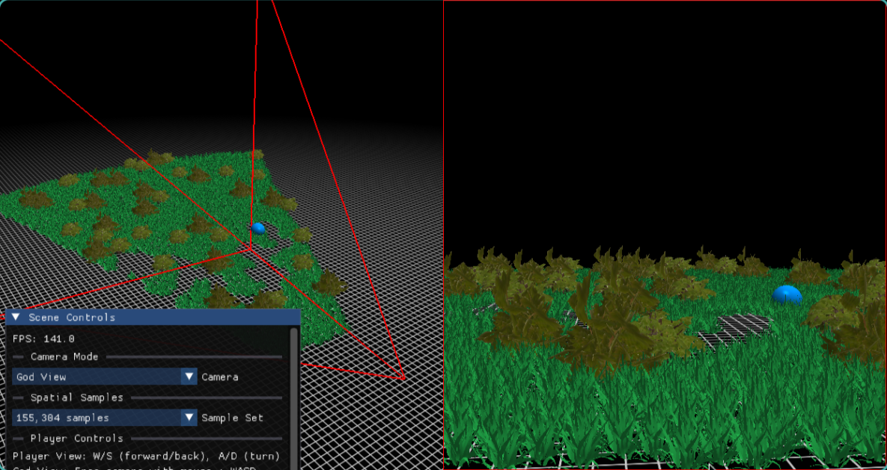
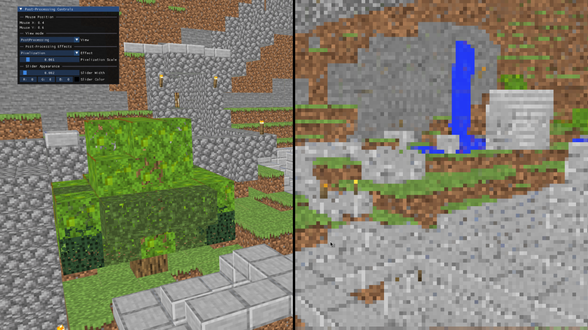

# OpenGL-Assignments

This repository contains assignments for CS 550700: Introduction to Graphics Programming and Applications at National Tsing Hua University (NTHU).

## Overview

The assignments demonstrate various OpenGL techniques, including animation, framebuffer post-processing, and GPU-driven rendering. Each assignment is self-contained and includes source code, shaders, and resources.

## Showcase





### Prerequisites
- C++ compiler (GCC/Clang/MSVC)
- CMake (for building projects)
- OpenGL 3.3+ compatible GPU
- GLFW, GLAD, GLM, stb, and ImGui (included in `include/`)

### Building & Running
1. Clone the repository:
   ```bash
   git clone https://github.com/yourusername/OpenGL-Assignments.git
   cd OpenGL-Assignments
   ```
2. Enter an assignment directory (e.g., `assignment-1`):
   ```bash
   cd assignment-1
   ```
3. Build the project:
   ```bash
   mkdir build && cd build
   cmake ..
   make
   ```
4. Run the executable (usually named `project`):
   ```bash
   ./project
   ```

## Assignment Summaries

### Assignment 1: Animated Robot
Design and render an animated robot using OpenGL. Learn the basics of OpenGL setup, transformations, and simple animation techniques.

### Assignment 2: Framebuffer Processing & Post Effect
Render a large-scale scene with post-processing effects. Import OBJ models using Assimp, apply framebuffer operations, and use custom shaders for visual effects.

### Assignment 3: GPU Driven Rendering
Implement large-scale foliage rendering using compute shaders and indirect drawing. Demonstrates modern GPU-driven techniques, including frustum culling and efficient rendering of many objects.

## Assignment README Links

Each assignment directory contains a detailed README:
- [Assignment 1 README](./assignment-1/README.md)
- [Assignment 2 README](./assignment-2/README.md)
- [Assignment 3 README](./assignment-3/README.md)

## Credits
- Libraries: GLFW, GLAD, GLM, stb, ImGui, Assimp
- Course: CS 550700 Introduction to Graphics Programming and Applications, NTHU