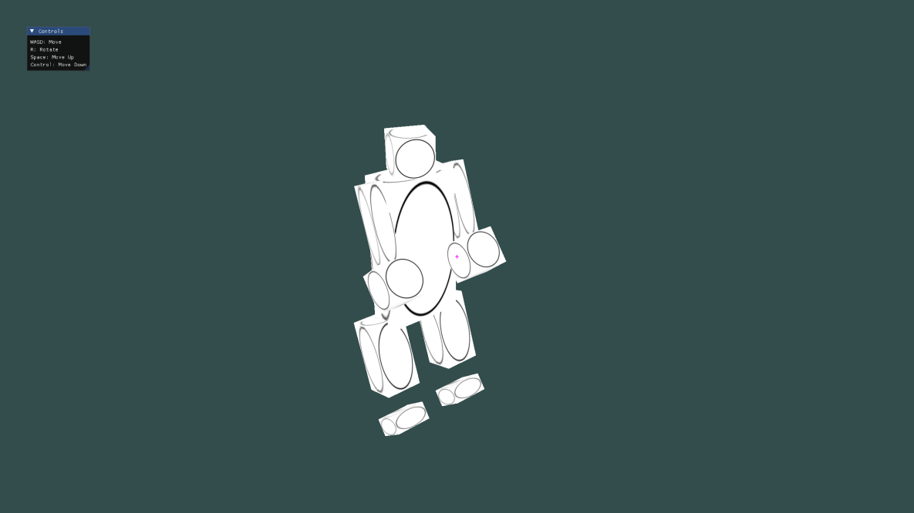

# Assignment 1: Animated Robot with OpenGL

## Overview
This assignment demonstrates the basics of OpenGL programming by designing and rendering an animated robot. The project covers essential graphics concepts such as window creation, rendering pipeline, transformations, and simple animation techniques.

## Features
- Basic OpenGL setup using GLFW and GLAD
- Hierarchical modeling for robot parts (head, arms, legs, body)
- Simple animation
- Camera controls for scene navigation

## Prerequisites
- C++ compiler (GCC/Clang/MSVC)
- CMake
- OpenGL 3.3+ compatible GPU
- GLFW, GLAD, GLM, stb, ImGui (included in `include/`)

## Building & Running
1. Open a terminal and navigate to the assignment directory:
   ```bash
   cd assignment-1
   ```
2. Create a build directory and compile the project:
   ```bash
   mkdir build && cd build
   cmake ..
   make
   ```
3. Run the executable:
   ```bash
   ./project
   ```

## Project Structure
```
OpenGL-Assignments/
└── assignment-1/
    ├── code/
    │   ├── main.cpp
    │   ├── shader
    │   ├── robot
    │   ├── mesh
    │   └── textureloader
    ├── include/
    ├── image.png
    ├── CMakeLists.txt
    └── README.md
```
## Controls
- Use keyboard WASD and mouse to move the camera and interact with the scene (see code for specific controls).
- Press keyboard r to start/stop animation

## Screenshots


## Credits
- Libraries: GLFW, GLAD, GLM, stb, ImGui
- Course: CS 550700 Introduction to Graphics Programming and Applications, NTHU

For more details, refer to the code and comments in the source files.
